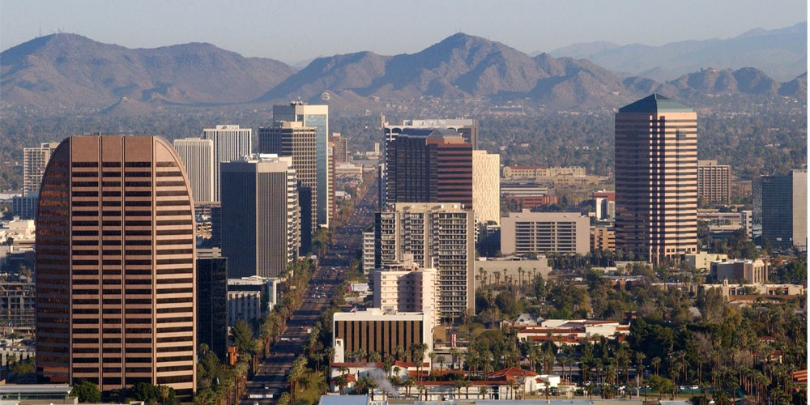

_The sputtering pour of the espresso machine, taking refuge in a hidden Starbucks tucked away from the sidewalk, swirls throughout my sluggish morning. It’s a brisk Saturday morning for southern Arizona in October and I am exhausted. The agenda already looks fierce today sprawled upon the white abyss of my iPhone calendar: 5 phone calls, 2 sponsor meetings and a team recap to wrap up the day. The earbuds go in, the saddle bag goes over my shoulder and I’m off. Here’s to building the future._

Arizona is experiencing one of the greatest fundamental transformations in the state’s history — and it is close to blowing it. On the shoulders of a recovering housing market, the people of the Sonoran desert are seeing technology as a prevalent theme for 2015 and beyond. High-tech Companies are migrating and expanding from California and the east coast to Arizona, and the term ‘Silicon Desert’ is sprouting up at bars and offices quicker than the press can count. The problem is that, despite great progress, the believers and the followers in a future for technology in Arizona are still a minority — and we need to fix that. Incredible developers and entrepreneurs who are chasing some of the greatest challenges in the world are amidst the grind and the trauma of starting disruptive companies throughout the valley and are passing by unnoticed, unrecognized and unsupported. Talented, passionate and motivated college students are graduating and leaving the desert for the more stable pastures of San Francisco, Boston and New York. Arizona has, for the first time, the opportunity to take on the world, beat the odds and create a brighter future of impactful tech companies that shape the world in astonishing ways. It’s time to double-down, hold on tight and play our cards right.

As a group of college students, there are some problems we can’t fix. We can’t force our state representatives to pass more welcoming bills for immigrating companies to the valley and we can’t turn every Arizonian into a coding champion in 36 hours; but what we can do is start the conversation about what the world of tech will look like in the next decade and where we stand amongst it. A hackathon serves as a representation of what the next generation of technologists should look like — an open, collaborative, enthusiastic, fearless and united movement who are behind shrinking the world and enriching every person’s quality of life. In order for the Silicon Desert to work, Arizona needs a similar stake in the future of its developers, programmers, entrepreneurs and evangelists. _Arizona needs a hackathon._

[Hack Arizona](http://hackarizona.org) isn’t about the latest mobile app or the newest JS library (seriously, why so many libraries?) — it’s about representing the unquenched thirst and the unshackled spirit of the hacker that is prevalent everywhere in the world, even in the sleepy town of Tucson, AZ. It’s about identifying a new generation of problem solvers, disrupters, thinkers, technologists, evangelists, and the bold that dare venture into undiscovered technical territory. It’s about recognizing the immense pool of unbelievable students that are spilling into the workplace, ready to bring wholehearted craftsmanship and fresh ideas behind the businesses that are on a mission to change the world. It’s about celebrating how far we have come and yet how much farther there is left to go. We want every passionate, motivated and restless soul that is ready to make an impact to attend— and we will drive ourself to clinical sleep deprivation to get you all here.

Ultimately, maybe we fail. Maybe Hack Arizona is nothing more than a cute story I tell my kids someday about how we tried to unite the southwest with a gimmicky event. But I would take the bet on hackathons. I believe that they are here to stay and will only expand alongside the limitless energy that the hacking community uses to propel them into every nook and cranny of every city and town. When it comes to the hacker against the world, most of the time, the hacker wins.

It’s not easy starting your state’s first major collegiate hackathon, but with the overwhelming support and camaraderie we have experienced from the incredible people across the country and the world who has supported us thus far, you make it all feel easy. And we can’t thank you enough for that.

Here’s to being insane enough to start a hackathon.

Here’s to building the future.

_[Hack Arizona](http://hackarizona.org) is a hackathon at the University of Arizona from March 6th-8th featuring 400+ of the most motivated, passionate and talented student technologists from across the country to participate in 36 hours of agile software, hardware, health and sustainability projects._
