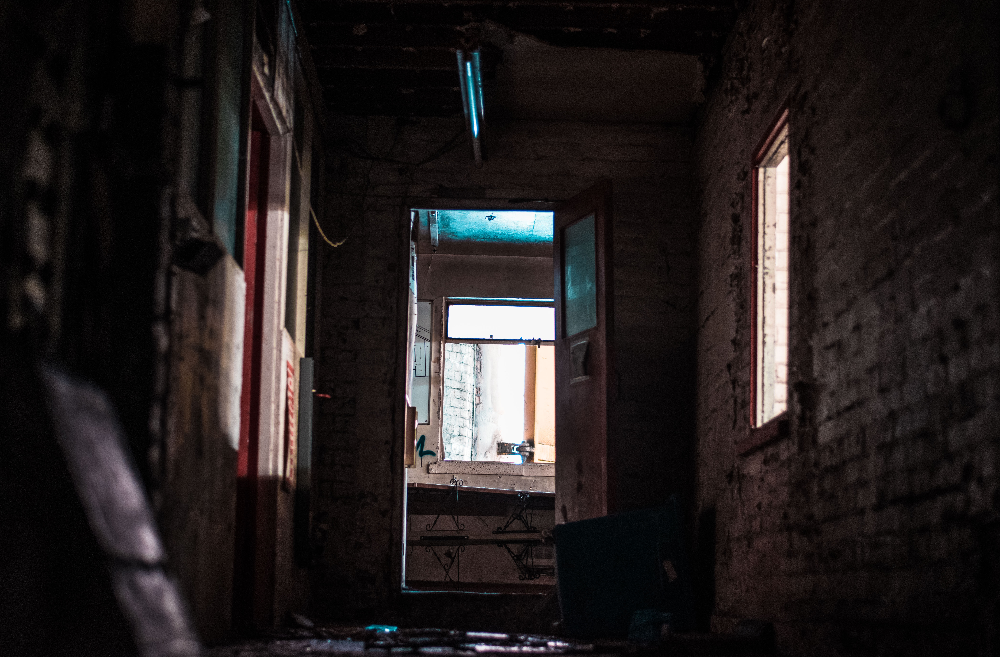

Our personal histories are written  with chapters full of order and others full of chaos. Our lives find order through our love: when we start new relationships, catch up with an old friend or feel empathy towards one another. And we find chaos through our loss: broken promises, losing a job, a bad breakup, or sometimes, a tragic death.
 
Earlier this year, I suddenly lost my father to a heart condition. It was a blur.  

In was a late Friday afternoon in San Francisco. Gin and tonic clinked as we toasted amongst friends and colleagues. A joke. Laughter. A Pause. A phone call. My dad was in the hospital.

After a desperate shuffling of mismatched clothes thrown into a duffle bag I hailed a cab to SFO International airport. The cab door closed. I think my driver could smell the sweat. 

“He’s going to be ok” I kept telling myself.

I felt nauseous.

Before I knew it the SFO departures terminal curb was outside my window. I grabbed my bag and stepped outside. Another phone call rang and I picked up.

He’s gone.

In the span of the time it took to throw some wrinkled t-shirts into a bag and drive 10 miles a life was condemned unfit for existence.  A vast network of everyone that had loved him and been loved by him was now deprecated. The last drying blot of ink on his history books. His lessons, advice and wisdom now echoes. No more “he is” and always “he was”. It felt so sudden. The molecules ripped apart. An atomic explosion.

My childhood erupted before my eyes and I felt like a small boy again. I dropped my phone onto the balmy terminal gate curb, staring at my boyish reflection that gleamed off the terminal bay doors. My skin was on fire and the emotional circuitry in my head was being fried out of my skull. I was on the come up of a bad acid trip and at the beginning of a molotov cocktail hangover.

I remember a shiver as a gust of wind gliding down my neck followed by a constricting pressure that wrapped around my neck. An iron grip. It was someone I had only met in passing before but it was different this time. I couldn’t breathe as the grip became tighter around my neck. I gasped for air as I choked deeper into the vacuum of time and space. I was sinking into the void of our universe.  It was terrifying. It was violent. It was Death.

What would ensue would be the hardest period of my life. A period that in many ways I am still living though and will continue to live through for the rest of my life. But through whatever I felt, experienced or regret doing -my overarching struggle was my lack of understanding about Death. Despite being someone who I had met many times before, that day, Death humbled me. Death welcomed me with immense grief, forcing me to realize how little I actually know about being alive.

Almost all of us have met Death. Some of us have had to meet Death with parents, siblings, friends, lovers or pets. Some of us have had to meet Death more than others. But we often don’t talk about Death. We try not to mention Death. Having a conversation about Death is taboo and depressing at best and distasteful and offensive at worst. We invent goals, fill our days with activities and soak in our achievements all while we avoid our inevitable appointment scheduled somewhere on our calendar to meet with Death.

It doesn’t have to be this way. <a href="https://deathoverdinner.org/" target="_blank">Death over Dinner</a> is a movement that is making shockwaves through social circles and taking charge on driving the biggest and more important conversation we all aren’t having: talking about Death. Death over Dinner provides guides and how-tos to help groups through their own death dinner. 
So on a warn summer Saturday night, surrounded by a group of close friends and the smell of takeout Burmese food wafting through my apartment -we took the conversation head on and had dinner with Death as our guest.
I learned so much about my friends, myself and Death that night. We wandered through talking about the impact of Death on the people we love. We explored how each one of us wants to die and we questioned what the important parts of our lives actually are.

That night, we had invited Death to our table as the enemy but we soon realized that Death is agnostic. We left that evening with a newfound take on what it means to be alive. Spending an evening with Death didn’t diminish my grief but the dinner contrasted the love and incredible life that's always there beneath our noses even when we don’t realize it.

While we cant bring back the ones we’ve lost to alleviate our pain, we can always pay respect to the cosmic tightrope stunt we call life. A performance that is full of terror, excitement, joy and pain. A performance that is equal parts order and chaos. A performance where we discover each other, find ourselves and hopefully learn as much as we can along the way.

And that’s certainly a performance worth living and dying for.

Love you, Dad.

 
 

Interested in hosting your own death dinner? 
[Check out my guide](/death-dinner)