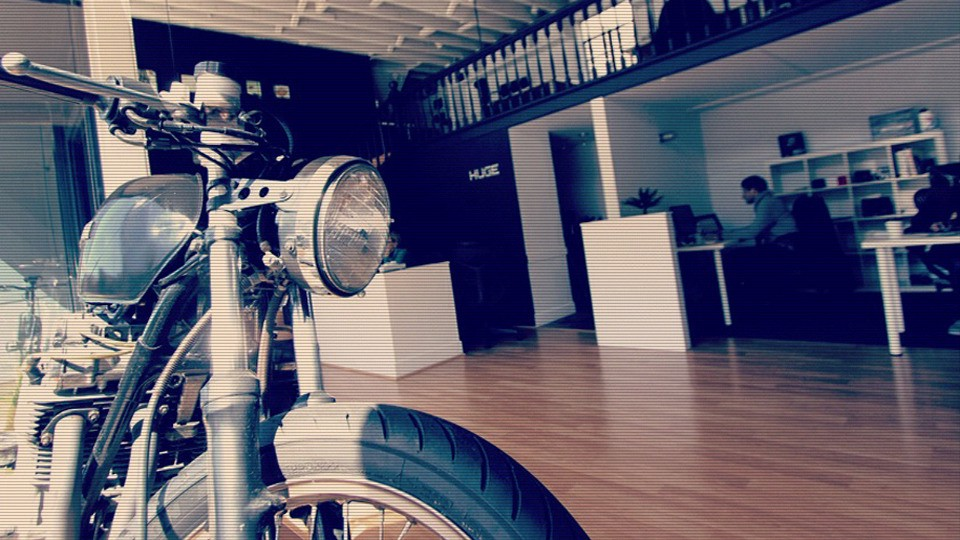

The elevator doors open to the tune of atmospheric drums against the backdrop of light chatter that ricochets off what seems to be a chic office themed as a mechanic shop. Lights flood the lobby, creating shadowy figures that circle above from the upstairs loft. Striped shirts, clear framed-glasses, leather shoes and painters caps speckle the crowd which is clustered around plastered pencil sketching on one wall, motorcycle frames hanging from the back ceiling and the buzzing cocktail bar right up front.

I look up from my drink to find myself in a conversation about the correct pronunciation of typography “leading” (it’s pronounced like “ledding” by the way). We turn down one hallway jumping to a conversation about the design thinking of a nearby Eames chair. I take another sip of my drink which matches the sky blue hue of the paint splattered on the wall leading to the staircase. We walk up a flight of stairs to the shadowy loft upstairs while talking about the feelings conveyed by the font of the Firestone tire sign seen through the window across the street.

This is SF design week. A city-wide celebration of design thinking and a showcase of industry-leading work from tech companies like Pinterest, Airbnb, and Atlassian as well as design firms like Huge and Ueno. I had come along for the evening pretending to a designer in order to learn more about how designers think and what challenges designers face in their daily work. I was undercover for the evening. I just had to say as little as possible, nod at the correct times and carefully follow conversations — like a slightly buzzed human sponge.

The night ended up being an eye-opening experience for me. In the beginning, I felt like an outsider -like the geek who was invited to drink jåger and smoke cigarettes at the popular kids’ prom after-party. I felt similar to how I now think designers and product managers must feel attending engineering events: feeling not totally out of place, but aloof and surprised by some of the differences between you and everyone else.

During the evening, I soaked up as much as I could about design systems, design thinking, what designers prioritize, how they think about products, and what products excite them and why they excite them. It was an invigorating experience that has motivated me to aggressively pursue a design education of my own. I feel as an industry we have really failed in communicating the immense value of a design education to the rest of the world.

Over Thai food and strong cocktails, I observed a group of designer friends and colleagues dissect the text editors in a few popular notetaking apps. They showed me how just a tiny pixel change can make a massive difference to the fluidity of the experience as well as how small inconsistencies in symbols, icons and layouts can completely ruin how a user understands the product. I learned about balancing a design between new users that need to get productive quickly but also for power users who need enough features so they can accomplish more. I was transfixed by their focus on deep user empathy and thinking in terms of goals that users want. I found it fascinating just how often systems without a UI are the best way to solve problems. This wasn’t the stereotypical designer conversation which is imagined as a critique of the color scheme of a new mobile app or a discussion on how to make something “pop” or an exploration of a new fancy animation sequence to grab user’s attention. These were detailed conversations about large, challenging, people-centric design systems. These were conversations on making sure we all put our effort towards things that actually solve problems and makes people’s lives better rather than making stuff for the sake of making stuff.

Silicon Valley told the world and their unborn kids to learn to code. With every coding boot camp and high school, computer science class is a rat race that leaves designs skills in a distant second place. We now are catching up to the sea of software that people hate because it’s bloated or because it’s intrusive and leaves us exhausted at the end of the day or because it’s sterile and makes our digital interactions feel less human.

I’m now a firm believer that not only should every engineer prioritize a rigorous design education but the rest of the world should as well. Better design skills don’t just make us better at our jobs — they make us better human beings by improving our perception of our relationship with the world and other people. Design thinking tells us how we can better help someone else and it tells guides us in answering some of the questions on why and how we interact with something inside and outside of our homes.

We need more design thinking in every part of the process. Rather than thinking about design and development stages, let’s start thinking about design and development harmony. Designers are some of the best sources of innovation as anyone else and we need to leverage them by providing a tighter integration loop between engineering, product, and design. Design thinking shouldn’t stop at the design — in fact, it shouldn’t stop at all. We all share a common daily exercise in trying to better understand people. I can’t think of a better tool to accompany you in your quest to understand human beings than design.
