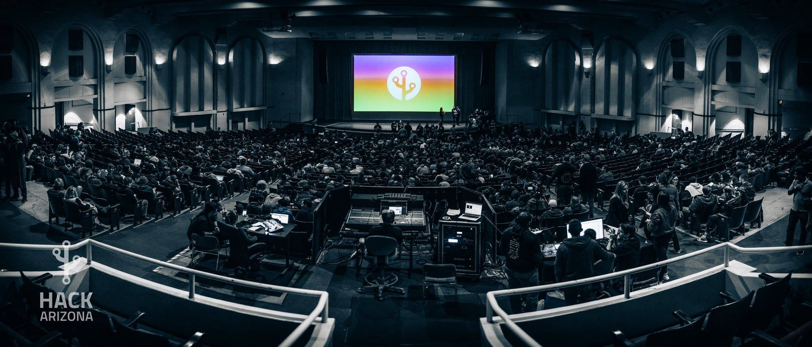

Everything was completely black. My arm violently shook as metallic voices chattered beside my head. I opened my eyes to find a security guard towering over me talking into his radio. Shaking off my fatigue, I looked around to find myself sprawled out on the ground. I bolted up from the cold carpet discovering my three friends passed out on the ground next to me, fast asleep. The guard let out an exacerbated sigh and said “This area is closing now, y’all really need to leave”. I helped wake up the collective group and as we all climbed to our feet; shaking off sore bodies, dry mouths and bloodshot eyes.

It was January 15th, 2015, a cold winter morning in the center of the University of Pennsylvania campus — about 2300 miles from home. My friends and I had traveled from across the country (Arizona) to spend 36 hours coding non-stop fueled by nothing but stale coffee, Philly cheesesteaks and the occasional granola bar. “How the hell did I get here?”

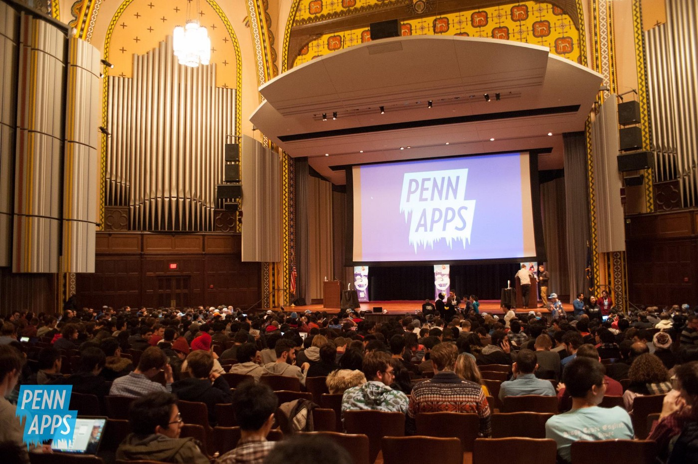

I had gotten there by signing up for PennApps — a 1000+ student hackathon at the University of Pennsylvania where students assemble into 4-person teams to see what software or hardware projects they can build within 36 hours. Think of a hackathon as a recreational cross country meet except subtract the running shoes and add computers, power strips, Redbull and complaints about the wifi signal. My friends and I had just overslept and missed our wake up call to meet for the closing ceremony of PennApps in the UPenn’s student union. The security guards were here to kick us out because the venue was closing.
My group of 4 friends and I had gone to PennApps to meet a few of its organizers and learn how a hackathon at a scale of 1000+ students operates because we were somehow crazy enough to be throwing our own hackathon is less than 3 months from then.

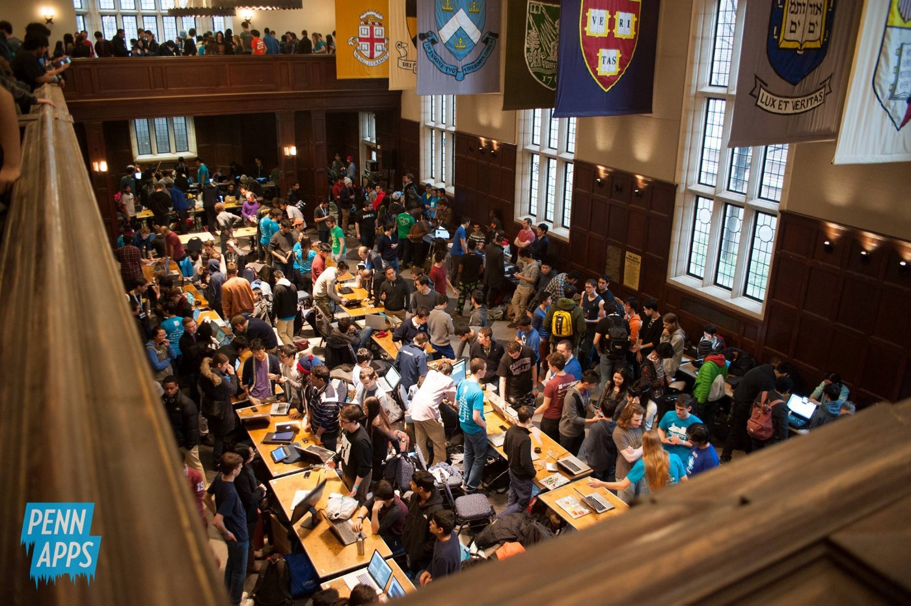

I didn’t wake up one day and think _“Man, you know what? I am going to spend the next three years going to hackathons, throwing hackathons, analyzing hacker culture, fundraising, managing an organizing team, working on registration systems, worrying about budgets and attendance numbers and, most importantly, sometimes failing at all of the above”_. It just sort of happened.

At the University of Arizona, I saw a problem: students were not engaging with technology and working on projects in a meaningful way outside of the classroom. I was fortunate enough in college to have an incredible support network of friends, colleagues and mentors that I could discuss ideas with, prototype solutions, hack together side projects, and conduct experiments. I didn’t see a platform on campus or anywhere near campus that offered a similar experience to what I had been fortunate to experience, so I somehow convinced 4 other equally-insane people that we should try and start something on campus to do something about it.
After studying various solutions to the problem, we landed on the hackathon as a model that would work for our audience (college students in the southwest). And just like that, in October of 2014, the founding Hack Arizona team was assembled and the Hack Arizona organization was born.

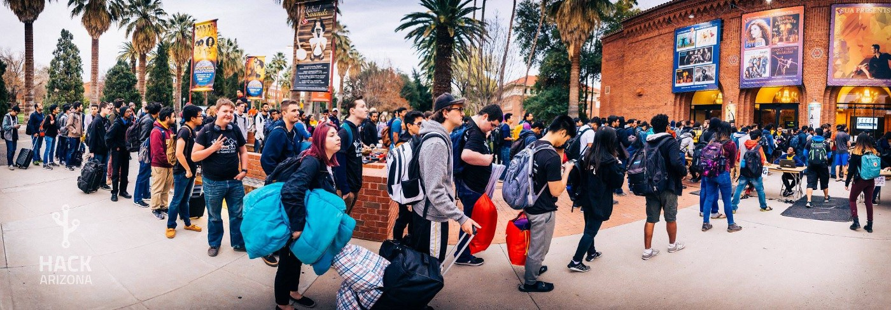

This past January, over 800 students and 250+ mentors and sponsors from across the country joined us in Tucson, AZ for our 3rd annual Hack Arizona. As a graduating senior, this was my last hackathon where I served as Hack Arizona’s Director of Sponsorship and Chief Organizer and I feel that some reflection is in order. I have learned a lot over 3 years of hackathons. I have been humbled and inspired by the community and I feel that Hack Arizona has been the most rewarding thing I have ever done. It has truly been a privilege to serve the hacker community and to have the opportunity to watch something as seemingly simplistic as a hackathon change the lives and trajectories of so many people. My aim in writing this piece is to both inspire those that haven’t been to a hackathon to go to one and to open a dialogue with other hackathon organizers (experienced or novice) about strategies for starting hackathons and fostering hacker culture in your own community. I have also realized that a majority of what I have learned can be applied to other entrepreneurial endeavors, so even if hackathons aren’t really your style, I am hoping you can still get a lot out of this too.

## It’s never about you, it’s about the mission

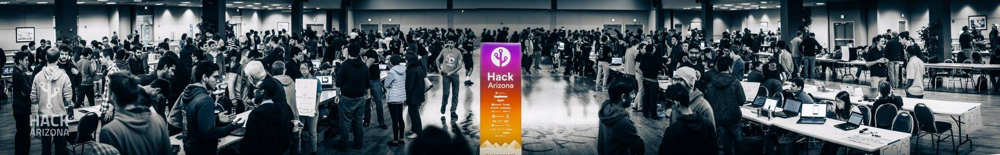

I have seen too many founders of non-profits and startups let the newfound attention after starting something go their heads. Yes, starting a major collegiate hackathon is exciting. For the first time in your life lots of people will want to talk to you: reporters, higher-ups at major tech companies, your professors and your colleagues. It can be easy to become absorbed with how the thing you started changes the way people perceive you but it’s incredibly important to remember that the maelstrom of activity and attention is not about you; it’s about your mission.

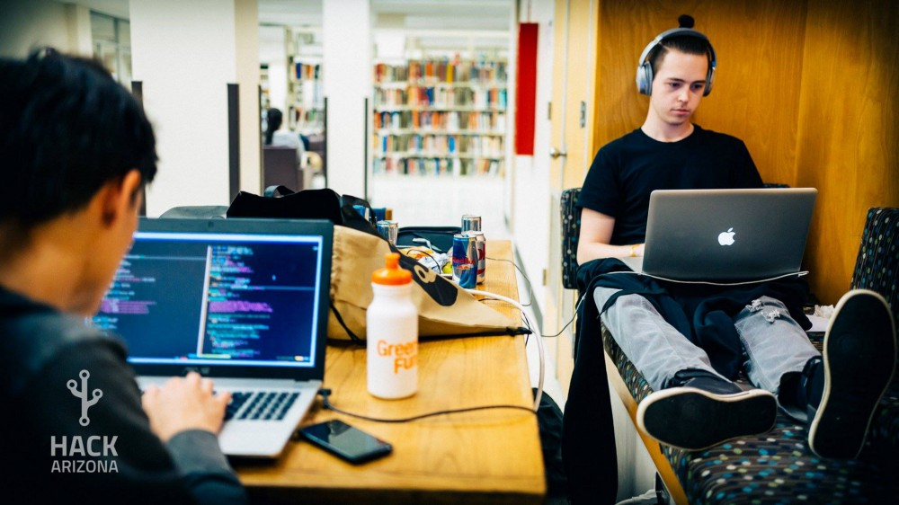

Throughout my time at Hack Arizona I was a servant to the mission and to the community I served. Speaking candidly, it wasn’t always easy to remain focused on the mission. I recall a distinct moment during the 2nd Hack Arizona where an attendee chastised me passionately about how my team and I had ‘cheaped out’ on the condiments for our gourmet sandwich bar after the organizing team and I toiled over the past 6 months to raise enough money to provide free food for the weekend for all of our hackers. Yes, at that point in time, I felt a little disconnected from the community as it was hard to swallow the lecturing hacker’s fervent rhetoric, but this instance sticks out because it is a rare occasion and in most circumstances the community I have worked with over the past 3 years have been inspiring, humble, helpful and grateful. The good times outweigh the bad 10 to 1.

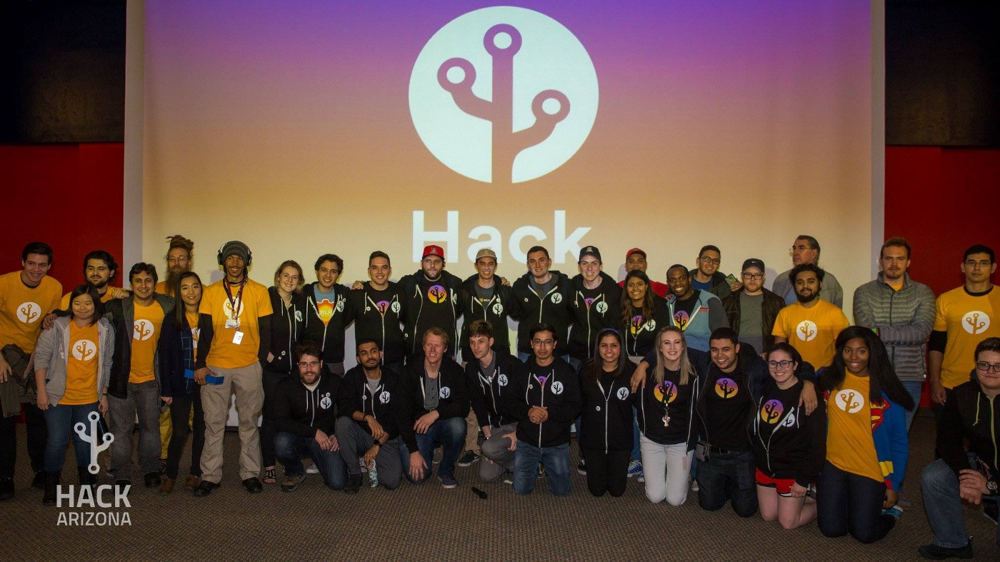

I learned that if you can detach yourself from your mission and orient yourself both hierarchically and mentally as an actor in the pursuit of that mission — you will be better off. When you become an actor in a mission rather than linked to the mission itself you create a larger stage for others to join and allow new members to become actors both internally and through partnership. It’s hard to convince others to join you in tackling an ambitious goal, with a low chance of success and to do it all for free. Just as you would expect your team to own the portions of your organization that they are responsible for in order to make the organization successful, it’s important to let them own their portions of the spotlight too and to give them the space to grow into the leaders you know that they can become.

## Seriously, focus on your community

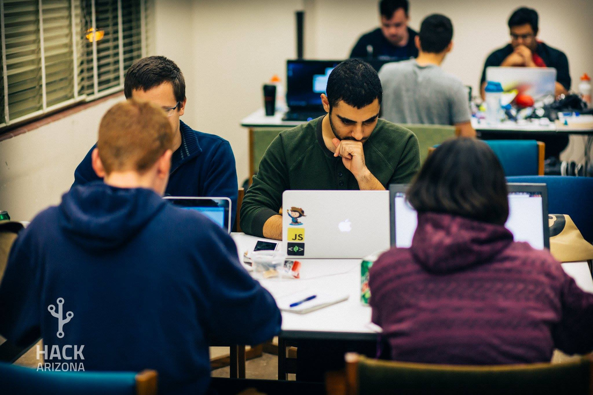

We knew from the beginning that our community (based in Tucson, AZ) and the surrounding southwest region didn’t need a competitive hackathon. Competitive hackathons with high-stake prizes, wicked talented developers and a mountain of hype work well for some schools but our hackers don’t get enough value from those sort of events. Our hacker community is nascent and we knew from the start that, even if we could somehow make a hackathon work here in Tucson, we would have to move a big amount of local organizational and bureaucratical inertia to make it happen.

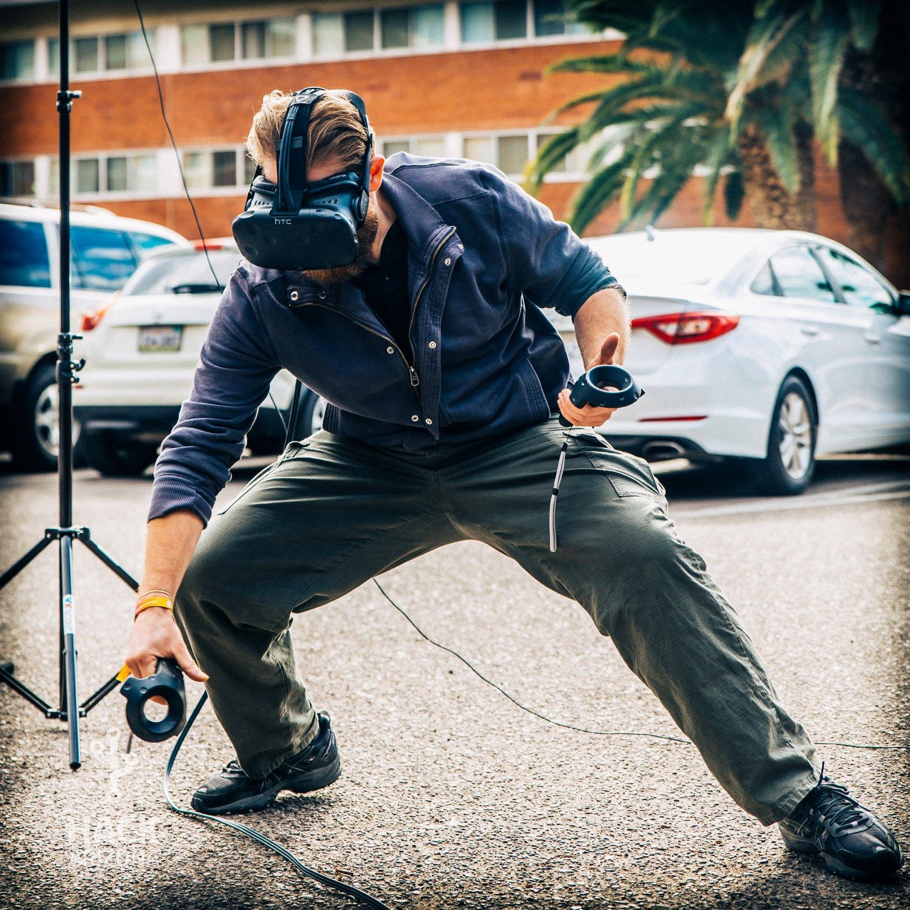

Every member of the Hack Arizona organizing team is a direct end-user of what we are building. Shortly after deciding that we were going to actually try and pull this hackathon thing off, the founding team and I sat down and synthesized our own needs and wants as Tucson hackers as well as feedback we got from from probing the greater Tucson and southwest hacker community. As we constructed the framework for how the hackathon would operate, we knew that it would need to support 4 key features for our hackers:

1. A platform to showcase hacker talent to a large audience for perhaps the first time in their lives.
2. First-class opportunities for internships and full-time technical positions at renown tech organizations.
3. Event structure that promotes collaboration and introduces students to applying classroom knowledge to building stuff quickly by experimenting and iterating on an idea.
4. A cohesive brand and mission that the community can rally around, feel a part of and contribute to (during or after the hackathon weekend).

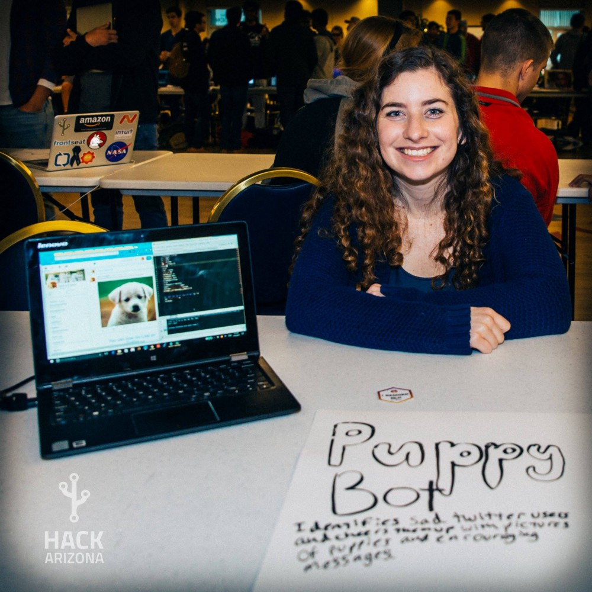

To accomplish these 4 primary objectives we had to engineer our event to ensure that we satisfied those base level requirements before expanding into features of the event that would distinguish us. To build the best platform to showcase the work of hackers, we de-emphasized competition by giving prizes and awards to more teams in more diverse categories, we hired full-fledged media teams to showcase a majority of the projects and we used project submission software that allowed for projects to be public, shareable and accessible by anyone online. We provided more first-class opportunities for students by going after high-quality sponsors (many of which had never recruited at our school before) and giving them with a great sponsorship experience. We promoted collaboration by giving students lots of space in our 5-floor venue to spread out (no fold-out-tables-in-a-gym setup here) as well time before the event to team up and meet new people during our matchmaking activities. Lastly, we built a cohesive brand through lots of time and energy refining our mission, communicating it to as many people as we could before and during the event and making sure that hackers felt as though they were a part of it by providing them with the best experience we possibly could.

The southwest isn’t New York City, Boston, San Francisco or Los Angeles. While many of the organizing team and myself have been to many hackathons in those cities we knew early on that copying them directly wouldn’t have the same effect on our community as those events had on theirs. We implemented some of the things we learned from other organizing teams at other hackathons but the vast majority we created from scratch. By focusing on our community we made our organization and our hackathon unique because our community is unique. As someone who has been to dozens of hackathons across the country, I still feel that what our community has helped us build is one of the best hackathons in the United States. (Disclosure: I am obviously bias).

## Your sponsors are your customers and your partners

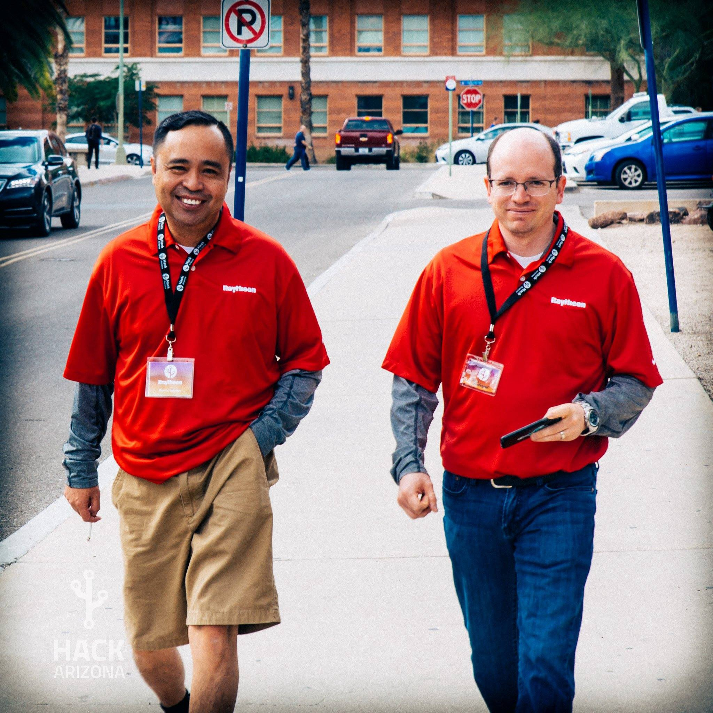

The moment you forget this — you lose sponsors.

I have seen other organizers treat sponsorship as a donation. It’s not uncommon to hear: “We’re a non-profit organization based out of the university, so a sponsor is really just giving us a tax-deductible donation, right?” That may be true, but sponsorship is so much more than that.

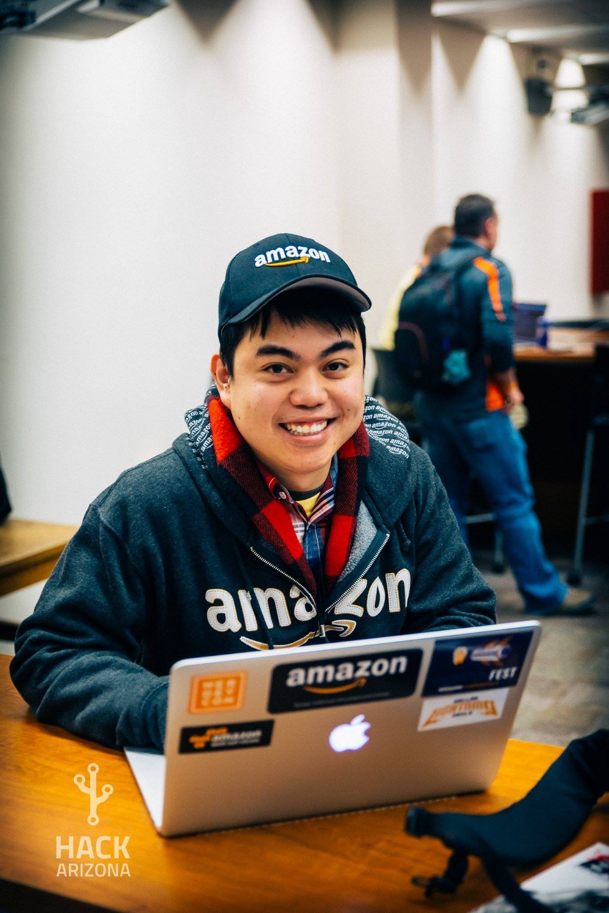

Sponsors spend lots of time preparing their staff, determining category prizes, attending their own meetings about the hackathon, having phone calls with the organizing team and usually mentors and reps from a sponsoring organization aren’t getting compensated to be there. These other activities which incorporate sponsorship outside of the monetary sponsorship payment are what I refer to as the “invisible costs” of sponsorship and a sponsor is usually incurring a lot more invisible cost than hard sponsorship costs. This means that it’s much more convenient for a sponsor to not waste the time and money going to our event than going to it.

From the beginning of Hack Arizona, I focused the sponsorship team on providing as much value to our sponsors as possible. This meant listening to what they wanted and thinking of ways to provide them with metrics to measure their ROI (number of social media impressions, resume data, number of signups to their platform or API, ext) so that they felt like a valued member of the partnership and had reasons to keep coming back. Sponsors are just like customers. Sponsors want marketing exposure, they want a recruiting platform and they want to pay for a great product; it’s just that the product in this case is a hackathon rather than something you buy off the shelf or from a website.

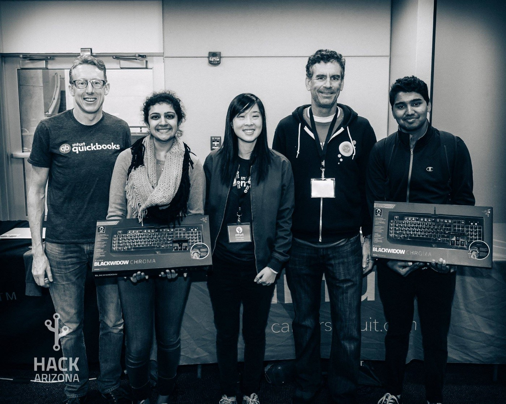

And it’s not just a one-sided working relationship either. Sponsors want you to succeed. They want to see the event get bigger and better every year because not only does it benefit them but being tied to a mission that is helping a community they have a stake in is rewarding and fun too. It’s important to architect a hackathon in a way that gives sponsors a voice and makes them a part of the community; otherwise sponsors will continue to be on the sidelines of what you are trying to build and eventually will exit the playing field all together.

I am not saying that our sponsorship system is perfect. I could write a whole post just on fundraising alone (and most likely will). I made an uncountable number of mistakes around fundraising but we have always had a strong influx of funds that allowed us to create an unbridled experience for our hackers and our sponsors continue to return which leads me to believe that we are not totally off in our strategy.

## Stand on the shoulders of giants

Since our hackathon is housed inside a large state university, there is a suffocating amount of bureaucracy that can kill our event or make it virtually impossible to get anything new started. If you take the inertia of the university and add to it the fact that the organizing team is volunteering their time and sweat into the cause for free and that our member base is in a constant state of flux due to people graduating -it can seem like a daunting amount of obstacles are in the way of a successful hackathon. When things with Hack Arizona really started to pick up before our first event, I knew that we would need a careful strategy in regards to the university system in order to pull off the hackathon and to ensure that it would keep going after the first year.

So I asked myself, _“How could we use this organizational inertia to our advantage?”_

Let’s assume for a moment that you are starting a new autonomous bus startup. You will probably have to produce the software to make your buses autonomous, but will you have to install new lanes for them to drive on? What about specialized bus stops? Will you have to manufacture the buses too or could you use existing ones? In Tucson, we have a lot of buses all with their own existing infrastructure (stops, lanes, policies, ext.) Why not leverage that as much as possible so that you can focus on making the software for piloting the bus the best it can be?

Similar thinking is what we applied to the hackathon. Rather than maintaining an entire venue and all of the complex logistics around facilities, setup, teardown, equipment, shipping, ext. — we patterned with the University of Arizona’s Library system to handle most of that for us. The venue we used for the event, the Science and Engineering Library, had enough room for 1200 students, robust wifi and power infrastructure, tables, chairs and breakout areas already set up, staff and policies for handling facility maintenance and a shipping port that all of our materials for the event could get shipped to. The Library team drastically reduced the the amount of complexity the Hack Arizona organizing team had to consider when running the event.

Likewise on the fundraising and partnership side, we leveraged department allies in UA’s Department of Computer Science to help us attract some of their closest department supporters and companies looking to hire more UA students, (thanks, Bridget!). This allowed us to get in front of potential sponsors when we had no track record of success. This partnership was also crucial in helping us garner professor and faculty support of the event as well as in helping us engage with CS students both as attendees as well as new members of the organizing team.

Both of these partnerships were crucial to the execution and success of the hackathon. Leveraging the existing system also has allowed Hack Arizona to mitigate risk against future mistakes in student leadership. While I have full confidence in the Hack Arizona organizing team to continue to make the hackathon bigger and better every year, the expert support from both the Library as well as the CS department ensures that they wont have to keep redoing the hard work that is already figured out. All they have to do it focus on making the hackathon experience better. I feel like that is a pretty cool place to be in.

## Don’t Stop (hackathons are just the beginnning)

This may seem antithetical to what you have read so far: I believe in the hacking community and our mission, but not necessarily hackathons.

Let me explain. Hack Arizona’s mission (to foster world-class hacker culture in the southwest) is an ambitious and long-term vision that will take multiple generations of organizers to even put a dent in. Hackathons as a trend work effectively now but a hackathon alone can’t get us to the end goal. We have no idea what the future holds and how hacking will evolve in the future. If we want to invest for the long term, we need to continuously ask ourselves: “What’s next?”

As a group usually at the edge of technology — hackers face a more rapid evolution that many other social groups. While I feel that Hack Arizona’s hackathon will continue to be effective for quite a while, the team and I have already begun to plan for what the next steps will be for doubling-down and building a more robust community. What does that look like? Hardware labs for more departments on campus, more hacker-focused curriculum integration with the university, startup incubators, technical mentorship programs, startup engineering rotation programs and so much more.

Even after 3 years, it feels like we have just gotten started. There is still so much more work to do.
