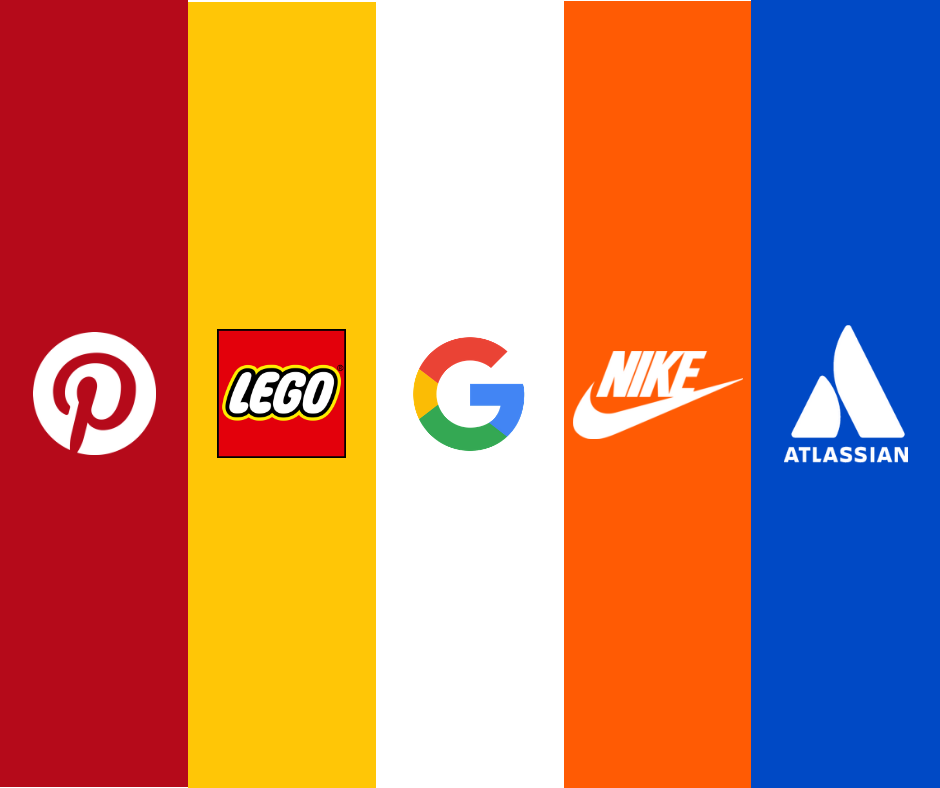
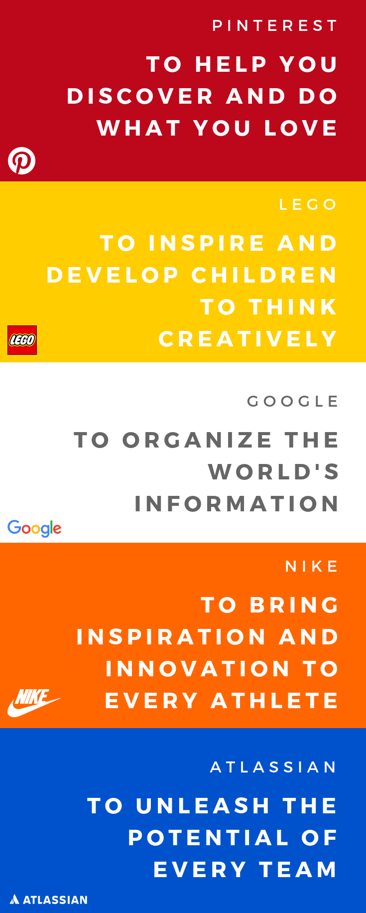

I’ve been thinking a lot about mission statements recently.

A strong mission is often what separates mediocre organizations from the exceptional, generation-defining ones. High-performing teams want projects that support a mission they believe in and global audiences want to engage with brands that are backed by an ambitious mission to change the world.

We live in a time where modern business is complex and abstract. Your customers and supporters may be on the other side of the world, only able to communicate with you via light traveling inside of a fiber optic cable. To make matters even more complicated, many of the largest and most successful companies in the world don’t even produce a physical product, making it challenging to conceptualize what teams are actually working on. All of this fights against our human intuition that relies heavily on a physical and concrete world.

A well thought out mission statement can provide an anchor to help talent relate to their work and retain them over the long term as well as help develop a brand that captivates loyal customers and devote fans around the world.

Mission statements are important to me. A company’s mission is one of the largest motivators behind my career decisions. Getting up every day with a clear idea of what my team and I are striving for is not only a life raft for grinding through the difficult days but the mission serves as a mental model for how I prioritize what I work on and what risks I take.

Here are a few mission statement examples from some incredibly successful organizations:

These mission statements are incredibly effective branding, marketing and recruiting tools. They highlight an active subject (‘athletes’, ‘children’, ‘world’, ‘you’, ‘teams’) and they identify beneficial effects on those subjects (‘unleash’, ‘discover’, ‘inspire’, organize’). They surface a story on how they want to impact the world. Notice how none of these statements talk about products. If I were to remove the logos and company names from these slides, I would bet it would be hard for the vast majority of people to recognize that they belong to a software company, a search engine, a sportswear company, a visual discovery company or a toy company.

Several years ago, when I was running Hack Arizona we worked hard to develop a captivating message that would represent what we saw as our long-term vision. What we came up with was the result of multiple iterations and failed attempts to package 4+ years worth of work building one of the largest hackathons in the United States.

“To foster world-class hacker culture in the southwest by empowering students to pursue their ideas.” ~ Hack Arizona
I learned a lot developing this mission statement. Despite how crucial mission statements are to an organization, there are so many teams across the world getting it wrong. Here are some of the most common mistakes I see on an almost daily basis:

### 1. There's no mission
This is probably the most common of the company mission sins. Maybe your company never invested in defining what the company actually stands for or what it is trying to accomplish. Perhaps they are still thinking at the product execution level or business goal level. Not having any mission is dangerous over the long term because when the businesses inevitably needs to adapt or change directions the context of the organization will have to be reinvented all over again.

### 2. The mission is actually a business goal
Startups that tout missions like “be #1 in the CRM space” or “capture 50% of the cat sweater market” make me want to throw up in my mouth. Those aren’t missions but are business goals. This is the wrong thinking for so many reasons but the biggest one is that it pigeonholes everyone’s effort into a specific execution phase. Once that phase is over there’s little left to continue to work towards and ultimately the organization falls into the problem described in mistake #1 — where there isn’t a mission tied to the organization.

### 3. The mission doesn’t include people
*“To make cars faster and easier to use”*

*“To make shipping faster worldwide”*

At first glance, these mission statements seem similar to the form in mistake #2 but they are slightly different in that they abstract away a business goal but they mistakenly exclude people. If your business isn’t focused on solving problems for actual human beings than you don’t have a company -you have a hobby. When founders talk about things like “We want this software to make cars more efficient” or “we want this app to help reduce waste” they are taking away from the users that actually will be using the product (you know the ones that actually matter in the business equation).

### 4. The mission isn’t big enough
The last major fallacy is a subtle one. If we look back to the mission statements from great brands above we see a common thread: they all focus on using language that quantifies their reach and footprint on the world. Taking Google, for example, they craft their mission statement with the phrase “The world’s information”. This has been a guiding light for Google for nearly 20 years. They want to ingest, index, categories and display the world’s information — no matter its history or location. Google now reaches more than 115 countries in over 100 languages. The scale of Google’s mission creates a framework of thinking on a global scale that guides the company through product and business decisions as well as acts a major conduit for attracting some of the brightest minds in the world to join them in their quest on working on the largest systems in the world.

I hope you are now at least thinking about just how important a strong mission is for your organization and how it can be used to propel you and your team. I truly believe that over the next 100 years, as businesses disrupt and carve out niches in every industry across the world, mission-driven leadership will decide who reinvents themselves and survives and who stays clinging to old ways of motivating people and becomes history.